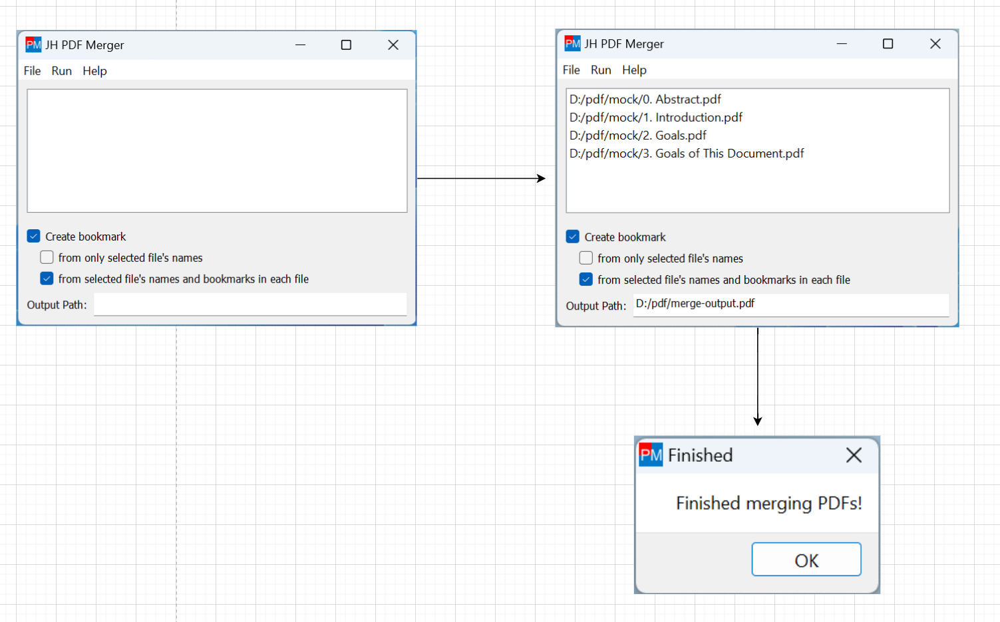

# JH PDF Merger

<h3 align="center"> <a href='./README.md'>English</a> | 简体中文</h3>

JH PDF Merger 是一个简单的图形界面应用程序，用于将多个 PDF 文件合并为一个。

合并后的 PDF 文件的书签将根据原始 PDF 文件的文件名和书签来创建。

## 目录

- [安装](#安装)
- [使用](#使用)
- [待办事项](#待办事项)
- [开发](#开发)
  - [安装依赖](#安装依赖)
  - [运行](#运行)
  - [翻译](#翻译)
  - [打包](#打包)
- [贡献](#贡献)

## 安装

在 [发布页面](https://github.com/qwinsi/jh-pdf-merger/releases) 下载最新版本。

目前，仅提供 Windows 版本的应用程序。

对于 Linux 或 macOS 用户，因为目前还没有现成的发布版本，你需要下载源代码并直接运行 Python 程序。请参阅下面的 [开发](#developing) 部分以获取更多详细信息。

## 使用

打开应用程序，执行以下步骤。

1. 依次点击 "文件" -> "添加文件" 来添加 PDF 文件。
2. 底部的 "输出路径" 框已经自动填充了输出文件的默认路径。如果需要自定义的话，可以更改它。
3. 点击 "运行" -> "合并文件" 来合并 PDF 文件。
4. 等待程序运行完成。完成后会弹出一个消息框。



## 待办事项

- [ ] 发布 Linux 和 macOS 版本的发布版本。
- [ ] 添加更多的语言支持。
- [ ] 添加更多功能，例如拆分或操作 PDF 文件。

## 开发

这个程序是用 Python 编写的，使用 PyQt5 作为 GUI 框架，因此从技术上讲，它可以在任何支持 Python 和 PyQt5 的平台上运行（Windows、Linux、macOS 等）。

### 安装依赖

```shell
python -m venv venv
./venv/Scripts/activate
pip install -r requirements.txt
```
### 运行

```shell
lrelease ./lang/*.ts # Generate ./lang/*.qm files
python app.py
```

注意，`lrelease` 工具是随 Qt 一起提供的。你可以在 Qt 安装目录中找到它。例如 `C:\Qt\Qt5.14.2\5.14.2\mingw73_64\bin\lrelease.exe`

如果你不想安装 Qt，你可以从我们的最新发布中获取 *.qm 文件。下载 zip 文件并解压，*qm 文件在 `lang/` 文件夹中。


### 翻译

你可以执行以下步骤来帮助翻译。

首先运行 pylupdate5 来更新 .ts 文件。注意，如果源代码没有改变，.ts 文件也不会改变。

```shell
pylupdate5 app.py -ts ./lang/*.ts
```
然后手动编辑你想要翻译的 ts 文件。例如 ./lang/zh_CN.ts

最后使用 Qt 的 lrelease 工具将 .ts 文件转换为 .qm 文件。运行程序来检查你的翻译效果。

```shell
lrelease ./lang/*.ts
```

### 打包

运行以下命令来打包应用程序。

```shell
lrelease ./lang/*.ts # Generate ./lang/*.qm files
pip install PyInstaller
pyinstaller app.spec
```
现在你可以找到 `dist/jh_pdf_merger` 文件夹，其中包含可执行文件 `JH PDF Merger.exe` 和所有依赖项。
你可以将此文件夹复制到任何你想要的地方。

## 贡献

欢迎提出 issue 或开 PR。
