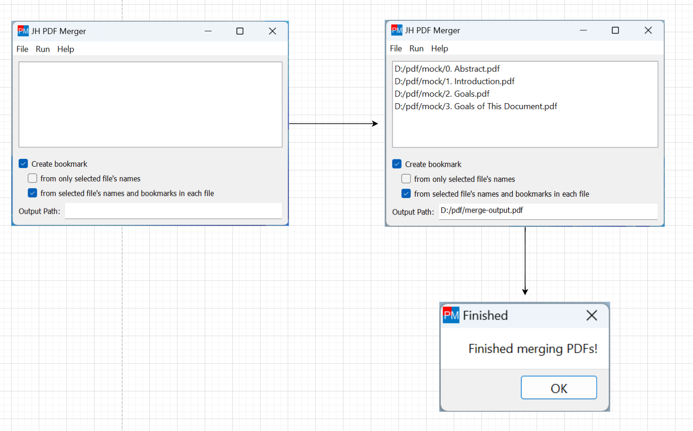

# JH PDF Merger

<h3 align="center"> English | <a href='./README-zh_CN.md'>简体中文</a></h3>

*JH PDF Merger* is a simple GUI application to merge multiple PDF files into one.

The bookmarks of the merged PDF file will be created based on the file name and bookmarks of the original PDF file.

## Table of Contents

- [Installation](#installation)
- [Usage](#usage)
- [TODO List](#todo-list)
- [Developing](#developing)
  - [Install dependencies](#install-dependencies)
  - [Running](#running)
  - [Translation](#translation)
  - [Packaging](#packaging)
- [Contributing](#contributing)

## Installation

Download the latest release from [the Releases page](https://github.com/qwinsi/jh-pdf-merger/releases).

At present, only Windows version of the application is provided.

For Linux or macOS users, because there is no ready-to-use release so far,
you may need to download the source code and run the python program directly. See the [Developing](#developing) section below for more details.

## Usage

Open the application, do the following steps.

1. Click "File" -> "Add Files" to add PDF files.
2. The "Output Path" box at the bottom has automatically been filled with a default path for the output file. You can change it if you want to customize it.
3. Click "Run" -> "Merge Files" to merge the PDF files.
4. Wait for the program to finish. It will pop up a message box when it's done.



### Making bookmarks

There are 3 methods for making bookmarks. You can click the button in the main windows to switch between them.

- **Method 1**: (Default) The bookmarks will be created based on both file name and bookmarks of original PDF files. This happens when you check both the "Create bookmarks" checkbox and the "from only selected file's names" checkbox.
- **Method 2**: The bookmarks will be created based on the file name of original PDF files. This happens when you check the "Create bookmarks" checkbox and uncheck the "from only selected file's names" checkbox.
- **Method 3**: No bookmarks will be created. This happens when you uncheck the "Create bookmarks" checkbox.

For example, say you have 2 PDF files: `file-A.pdf`, `file-B.pdf`.

```
file-A.pdf
│-- Chapter 1
    |-- Section 1.1
    |-- Section 1.2


file-B.pdf
|-- Chapter 2
|   |-- Section 2.1
|   |-- Section 2.2
|-- Chapter 3
    |-- Section 3.1
    |-- Section 3.2
```

Method 1 will give you:

```
merge-output.pdf
|-- file-A
|   |-- Chapter 1
|       |-- Section 1.1
|       |-- Section 1.2
|-- file-B
    |-- Chapter 2
    |   |-- Section 2.1
    |   |-- Section 2.2
    |-- Chapter 3
        |-- Section 3.1
        |-- Section 3.2
```

Method 2 will give you:

```
merge-output.pdf
|-- file-A
|-- file-B
```

Method 3 will give you:

```
merge-output.pdf
(No bookmarks)
```


## TODO List

- [ ] New bookmark-making method: Combine all bookmarks of original PDF files (without file names).
- [ ] Publish Linux and macOS versions releases.
- [ ] Add more languages support.
- [ ] Add more features such as splitting or other manipulation operations on PDF files.

## Developing

This program is written in Python and uses PyQt5 as the GUI framework, so technically it can run on any platform that supports Python and PyQt5 (Windows, Linux, macOS, etc.).

### Install dependencies

```shell
python -m venv venv
./venv/Scripts/activate
pip install -r requirements.txt
```
### Running

```shell
lrelease ./lang/*.ts # Generate ./lang/*.qm files
python app.py
```
Note that the `lrelease` tool is shipped with Qt. You can find it in the Qt installation directory. e.g. `C:\Qt\Qt5.14.2\5.14.2\mingw73_64\bin\lrelease.exe`

If you don't want to install Qt, you can get *.qm files from our latest release. Download the zip file and extract it, *qm files are in the `lang/` folder.


### Translation

To help with the translation, do the following steps.

First run pylupdate5 to update the .ts files. Note that if the source code is not changed, the .ts files will not be changed as well.

```shell
pylupdate5 app.py -ts ./lang/*.ts
```
Then manually edit the ts file you want to translate. e.g. ./lang/zh_CN.ts

Finally use Qt’s lrelease utility to convert the .ts files to .qm files. Run the program to check your translation.

```shell
lrelease ./lang/*.ts
python app.py
```

### Packaging

To package the application, run the following command.

```shell
lrelease ./lang/*.ts # Generate ./lang/*.qm files
pip install PyInstaller
pyinstaller app.spec
```
Now you can find `dist/jh_pdf_merger` folder, which contains the executable file `JH PDF Merger.exe` and all the dependencies.
You can copy this folder to anywhere you want.

## Contributing

Feel free to open an issue or submit a pull request.
